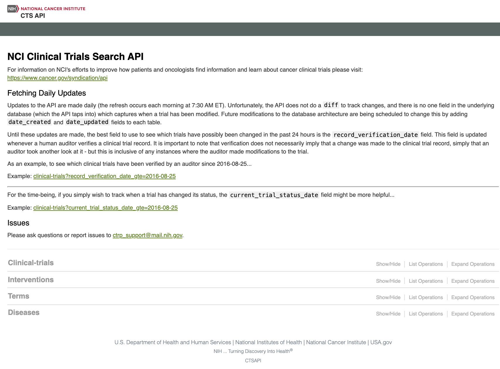

# Ctrials
# NCI Cancer Clinical Trials Application

## Description

This is a web application that allows users to gather specific information about National Cancer Institute supported clinical trials. Users will be able to look at information regarding clinical trials, based on diffferent parameters, such as : disease, disease progression, interventions, age of study participant, and location of clinical trials. The Ctrials application takes it a step further, by allowing users to see clinical trials that are conducted nearby, in the context of an interative Google map. It has desktop, mobile, and tablet responsive capabilities. 

- Homepage Search Tabs and Dropdown menus give user the ability to narrow down by the main parameters.
-     Health Condition patient is experiencing. 
-     Key Words and Phrases related to health condition or treatments.
-     Disease Porgression including cancer stages and reccurent health conditions.
-     Age of Prospective Study Participant

- Second Page of the application will provide further search breakdown.
-     User will be able to narrow down search results by different types of clinical trials by selecting all 
-     
-     

Adding a Google Map with a Marker to Your Website
## API Usage

### NCI Clinical Trials Search API

  #### https://clinicaltrialsapi.cancer.gov/
  
### Google Maps Jacascript API

  

## User Interface

## Inspiration

We hope to provide an easy to use tool for individuals looking for readily accessible cancer clinical research trials information. 

- [The National Cancer Institute](https://www.cancer.gov/about-cancer/treatment/clinical-trials/search/advanced)

We do not own the rights to any of the images included in this repository. All images were pulled from standard Google searches. We sought out inspiration from:

## Contact

Want to know more? Feel free to reach us at:

- [LinkedIn](https://www.linkedin.com/in/stephanie-a-pe%C3%B1a-1132bb16a/)
- [Email](mailto:stephp23@gmail.com)
