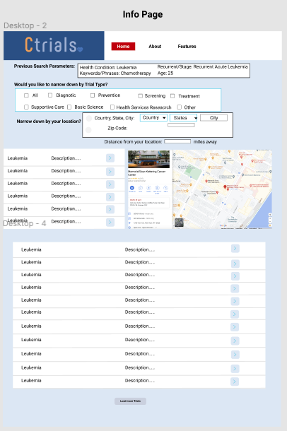

# Ctrials
## A NCI Cancer Clinical Trials API Based Application

## Description

This is a web application that allows users to gather specific information about National Cancer Institute supported clinical trials. Users will be able to look at information regarding clinical trials, based on diffferent parameters, such as : disease, disease progression, interventions, age of study participant, and location of clinical trials. The Ctrials application takes it a step further, by allowing users to see clinical trials that are conducted nearby, in the context of an interative Google map. It has desktop, mobile, and tablet responsive capabilities. 

## User Interfaces

### - Homepage Search Tabs and Dropdown menus give user the ability to narrow down by the main parameters.
-     Health Condition patient is experiencing. 
-     Key Words and Phrases related to health condition or treatments.
-     Disease Porgression including cancer stages and reccurent health conditions.
-     Age of Prospective Study Participant

### - Second Page of the application will provide further search breakdown.
-     User will be able to narrow down search results by different types of clinical trials by checking off and selecting all the different trial types to include.
-     User will have the choice to further narrow down results based on geolocation of the clinical trials, by selecting a country (from a dropdown menu), US state (from a dropdown menu), or actively inputing into a search bar for cities (needed for locations outside the United States). The user will also be able to input a desired distance away from their given location, to look for clinical trials. 
-     The results yeilded from based search will then be shown on Google Map with markers symbolozing each clinical trial in its location, near the user's given location. A list of the clinical trials shown on the map will be displayed below the map, with buttons that allow the user to click individual trials for further information.

### - Third Page of the application will provide detailed information on the chosen trial user has selected from the yeilded results. 

### Mobile Interface

### Tablet Interface

## API Usage

### NCI Clinical Trials Search API

  #### https://clinicaltrialsapi.cancer.gov/
  
### Google Maps Jacascript API

  #### https://maps.googleapis.com/maps/api/js?key=YOUR_API_KEY

  

## Inspiration

We hope to provide an easy to use tool for individuals looking for readily accessible cancer clinical research trials information. 

- [The National Cancer Institute](https://www.cancer.gov/about-cancer/treatment/clinical-trials/search/advanced)

We do not own the rights to any of the images included in this repository. All images were pulled from standard Google searches. We sought out inspiration from:

## Contact

Want to know more? Feel free to reach us at:

- [LinkedIn](https://www.linkedin.com/in/stephanie-a-pe%C3%B1a-1132bb16a/)
- [Email](mailto:stephp23@gmail.com)
